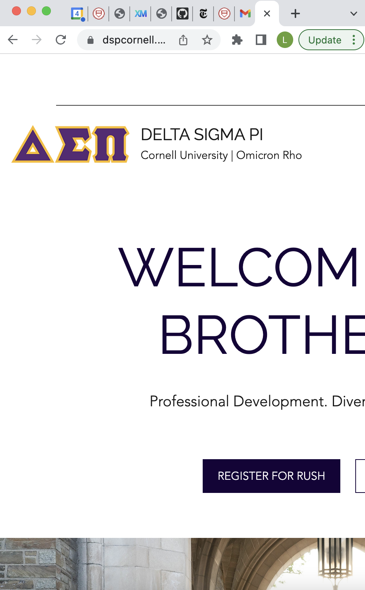

# Group Project: Design Journey

**For each milestone, complete only the sections that are labeled with that milestone.** Refine all sections before the final submission.

You are graded on your design process. If you later need to update your plan, **do not delete the original plan, leave it in place and append your new plan _below_ the original.** Then explain why you are changing your plan. Any time you update your plan, you're documenting your design process!

**Replace ALL _TODOs_ with your work.** (There should be no TODOs in the final submission.)

Be clear and concise in your writing. Bullets points are encouraged.

**Everything, including images, must be visible in _Markdown: Open Preview_.** If it's not visible in the Markdown preview, then we can't grade it. We also can't give you partial credit either. **Please make sure your design journey should is easy to read for the grader;** in Markdown preview the question _and_ answer should have a blank line between them.

## Client (Milestone 1)

### Client Description (Milestone 1)
> Tell us about your client. Who is your client?
> Explain why your client meets the client rules in the project requirements.

Our client is the Chi Psi Cornell chapter. Chi Psi is a social fraternity in the interfraternity council. This client meets the client rules because it is a campus organization that needs a static website.

### Client Questionnaire (Milestone 1)
> Develop a client questionnaire to learn more about your client and their goals.
> You may use the questionnaire below, you may modify the questionnaire below, or you may create your own.

1. Describe your organization and its purpose.

    Chi Psi is a fraternity whose purpose is philanthropy and brotherhood. It is focused on developing young men socially, morally, and intellectually.

2. What makes your organization and its services special or unique?

    This organization allows brothers to get financial scholarships and fellowships. It fosters strong friendships and helps brothers develop their character.

3. Why are you looking for a new website or updating your existing site?

    There is no Cornell chapter website, only the national one. The current national website is outdated and the information is difficult to find.

4. Who do you want to visit your site? Who do you believe is your website's intended audience?

    Our audience is students who could potentially be interested in joining the Chi Psi organization or Chi Psi alumni members.

5. When visiting your site, what actions do you want your visitors to take?

    We want visitors to learn more about the fraternity, learn about upcoming events, and learn about recruitment. Alumni can also learn about alumni events such as Homecoming.

6. What are your goals for this site?
    We hope to promote Chi Psi as a positive experience for students at Cornell by showing pictures from previous events. We also want alumni to be able to connect back to their brotherhood and see what is going on currently.

7. Is there a "feel" that you want for your site? Are there colors or imagery that you have in mind?

    We want to highlight Chi Psi's colors (purple and gold) and create a professional feel that is in line with the national website.

8. What are your three favorite competitors or similar organizations' websites? Why?

    Our three favorite competitors are DSP (the top business frat at Cornell), PSE (another top business frat at Cornell), and the Delta Upsilon Cornell Chapter website. All of these sites are very professional, and we hope that our website can obtain a similar feel to these sites.

### First Client Meeting Minutes/Notes (Milestone 1)
> Include your notes/minutes from your first meeting with your client.

- spent first five minutes introducing oursleves
- frat
- philanthropy
- brotherhood
- strong friendships
- informed client that we are making a static website
- financial scholarships and fellowships
- no Cornell website, only national site
- current site is outdated
- audience: students interested in recruitment, alumni
- goals for visitors: learn about frat, upcoming events, and recruitment
- show positive aspects of Chi Psi by showing pictures from current events that were held
- want alumni to see what is going on currently at Chi Psi
- want website to include fraternity colors and have a professional feel
- favorite competitors: business and social frats at Cornell with nice websites (ex. DU, DSP, and PSE)

### Client Website (Milestone 1)
> Tell us about the website that your client wants.
> Tell us the purpose of the website and what it is all about.
> Note: **If you are redesigning an existing website, give us the current URL and some screenshots of the current site.** (FireFox makes it easy to take a full screenshot of a page from the context menu (right click).)
> If you are redesigning an existing site, tell us how you plan to update the site in a significant way that meets the project's requirements.

Our client wants a website that will represent Chi Psi in a positive and professional light that both entices new recruits and keeps alumni up to date on the fraternity's happenings. The purpose of the site is to provide information about the fraternity and its events. Our client specifically wants information about the fraternity as a whole and its brotherhood, specific information about recruitment, and information about alumni events to appear on the website. The client wants us to mimic the look and feel of a professional fraternity's website and include imagery of the Chi Psi brothers, house, and events and use Chi Psi's national colors to make the website unique to the Cornell chapter of Chi Psi.

### Client Goals (Milestone 1)
> Identify your client's goals for the website.
> What kind of website do they want? What are their goals for the site?
> There is no required number of goals. You need as many goals as necessary to reflect your client's desires.

- Infrom new recruits on important dates and events
- Inform alumni on important dates and events
- Showcase pictures of the fraternity and active brothers
- Provide general information about the chapter

### Client Website Scope (Milestone 1)
> We want your project to be successful! It needs to be ambitious, but not too large.
> A good rule-of-thumb is that you should have about 1 content-full page for each team member.
> Explain why the website you will create for your client isn't too small and isn't too big.
> Explain why you think it's the right size for this project.

We believe the scope of the website is just right because Chi Psi is a national fraternity, but we are not creating content for nationals, just the Cornell chapter. More specifically, we will likely create webpages for recruitment, alumni of the cornell chapter, events, and philantropy (TBD after card sorting our content), and showcase imagery and text from the Cornell chapter. This is just the right size because it is only about the Cornell chapter and the main events and information that pertain to the chapter.

## Plan/Schedule (Milestone 1)
> Make a plan of when you will complete all parts of this assignment.
> This plan is for your team. There is no required format. Format it so that it works for you!
> Your plan should include when you will interview users and analyze their goals.
> Your plan should also include how and when you will assemble/create the sit's content.
> **Tip:** Your team should plan to work ahead. This project really isn't feasible to complete the night before a deadline.

We plan to complete all user interviews before Nov 14, which is our next meeting. In the time period before our next meeting, we will ask the client to send more details about the content they want us to include, as well as specific text and photos to use. We will analyze user goals right after the interviews are done. After we have the data collected from the user interviews, we will finalize the site's content together as a team during our next meeting on Nov 14. Our next meeting will be two days before the deadline of milestone 2, so we assume there will be enough time for us to finish the work. We will be in communication until then, so that we can continue to collaborate and work on the project before our meeting. For the final milestone, we will aim to have our user testing complete by the Monday before the project is due so that we can quickly revise the website at our final team meeting.

## Understanding Users (Milestone 2)

**Make the case for your decisions using concepts from class, as well as other design principles, theories, examples, and cases from outside of class.**

You can use bullet points and lists, or full paragraphs, or a combo, whichever is appropriate. The writing should be solid draft quality, but it doesn't have to be fancy.

### User Interview Questions (Milestone 2)
> Plan the user interview which you'll use to identify the goals of your site's audience.
> You may use the interview template below and revise it as much as you desire.

**User Interview Briefing & Consent:** "Hi, I am a student at Cornell University. I'm currently taking a class on web design and for a project, I am designing the website for Cornell's Chi Psi chapter. I'm trying to learn more about the people that might use this site. May I ask you a few questions? It will take about 10 minutes. You are free to quit at any time."

1. Please tell me a bit about yourself. You may omit any personal or private information.

2. Are you interested in Greek life at Cornell? If so, what do you know about the fraternities on campus?

3. Have you sought out information about a Cornell fraternity before? If so, what information were you looking to find? Did you find it?

4. What information would you need to know about a fraternity before deciding to join?

5. Where do you usually look to find information about Cornell greek life and greek events?

6. What haven't I asked you today that you think would be valuable for me to know?

**After the interview:** "This was really helpful. Thank you so much for agreeing to speak with me today. Have a great day!"

### Interview Notes (Milestone 2)
> Interview at least 1 person for every member of your team from your audience.
> Take notes and include those notes here. Make sure to include a brief description of each interviewee.
> **Copy the interview questions above into each interviewee section below.**
> Take notes for each participant inline with the questions.

**Interviewee 1:**

1. Please tell me a bit about yourself. You may omit any personal or private information.
   - Junior at Cornell studying Computer Science in Arts and Sciences who is in a social frat.

2. Are you interested in Greek life at Cornell? If so, what do you know about the fraternities on campus?
    - Yes, the general vibes of each frat and the stereotypes but not much more than that.

3. Have you sought out information about a Cornell fraternity before? If so, what information were you looking to find? Did you find it?
   - Yes. Looking for events that were happening. Word of mouth, which was way more popular for finding events than any other method.

4. What information would you need to know about a fraternity before deciding to join?
    - Info about the current members, what they and the frat do, what kind of people they are. All things that he thinks are probably hard to get on a website.

5. Where do you usually look to find information about Cornell greek life and greek events?
    - Directly talking to people in frats. Information usually isnt posted publicly for events worth attending, so he prefers just contact friends and ask them for information. Highly prefers word-of-mount

6. What haven't I asked you today that you think would be valuable for me to know?
    - Believes mostly just that its hard to get a grasp on frat information from a website and that a lot of greek events are vibe/personality based and its hard to quantify those and put it into website content.

**After the interview:** "This was really helpful. Thank you so much for agreeing to speak with me today. Have a great day!"

**Interviewee 2:**

TODO: tell us a bit about your participant

TODO: copy interview questions
TODO: take notes inline with questions

**Interviewee 3:**

TODO: tell us a bit about your participant

TODO: copy interview questions
TODO: take notes inline with questions

TODO: add additional interviewees as needed

**Interviewee 4:**

TODO: tell us a bit about your participant

TODO: copy interview questions
TODO: take notes inline with questions

TODO: add additional interviewees as needed

**Interviewee 5**

TODO: tell us a bit about your participant

TODO: copy interview questions
TODO: take notes inline with questions

TODO: add additional interviewees as needed

### Goals (Milestone 2)
> Analyze your audience's goals from your notes above.
> List each goal below. There is no specific number of goals required for this, but you need enough to do the job (Hint: It's more than 1 and probably more than 2).

Goal 1: Find events related to the frat

- **Design Ideas and Choices** _How will you meet those goals in your design?_
  - Create a calendar for events
- **Rationale & Additional Notes** _Justify your decisions; additional notes._
  - People interested in learning more about frats and their events have a hard time finding events online. By listing them online, more people will be able to learn about the frat and get in touch with brothers and visit the house.

Goal 2: Get more aquainted with the brothers

- **Design Ideas and Choices** _How will you meet those goals in your design?_
  - Display many pictures of brothers and quotes from them.
- **Rationale & Additional Notes** _Justify your decisions; additional notes._
  - By showcasing the brothers and their personalities, people who are interesting in learning more about the frat and the brothers to get a better feel for the frat's environment.

Goal 3: Learn about the values and social efforts of the frat

- **Design Ideas and Choices** _How will you meet those goals in your design?_
  - Display the philantropic efforts of the frat and their main values which direct the frats.
- **Rationale & Additional Notes** _Justify your decisions; additional notes._
  - Students who are interested in joining the frat are incredibly interested about learning more about the motivations behind the frat's actions. These main actions are driven by their goals and values, including charitable efforts.

### Audience (Milestone 2)
> Briefly explain your site's audience.
> Be specific and justify why this audience is a **cohesive** group with regard to your website.

Students at Cornell that are interested in joining Greek life. All of these students have the same goal with regards to visiting the website. These goals revolve around deciding which fraternity to join and answering uniform questions to make the decision for the students. We are providing the website with answers to these expected questions by addressing the audience goals we have found.

## Website Design Exploration (Milestone 2)

Identify three websites (preferably static websites) that exist today on the web to draw inspiration from. Please select websites that are similar to the website you wish to create.

Include two screenshots of the home page for each site: narrow and wide.

**We'll refer to these are your "example websites."**

1. <https://www.dspcornell.com/>

    

    

2. <https://www.cornellpse.com/>

    

    

3. <https://cornelldu.org/>

    

    

### Example Website 1 Review (Milestone 2)
> Review the website you identified above. (1 paragraph)
> In your review, include a discussion common design patterns and interactivity in the site.

The DSP website was one of the inspiration websites provided to us by the client; DSP is a well known business fraternity at Cornell. Their website is not responsive and is designed for wide screens only. They utilize a navigation bar across the top of the screen that features their name, logo, and page names, which looks sleek and professional. I really like the large banner on the homepage that provides options for potential new members: a register for rush button and a request a coffee chat button. I think this is a design pattern that we could take inspiration from for our website. I also really like the image carousel on their homepage, and I think that either this or a carousel could be a great use of interactivity for the homepage. They also utilized their fraternity colors of purple and gold (which are the same colors that we will be working with) in a really elegant way, and the dark purple banners featured throughout the website look great. Overall, although this site is not responsive, it has a beautiful visual design and features effective interactivity including an image carousel and buttons that lead to relevant forms and information for potential members.

### Example Website 2 Review (Milestone 2)
> Review the website you identified above. (1 paragraph)
> In your review, include a discussion common design patterns and interactivity in the site.

The PSE website is the second website provided to us by our client as inspiration, and is another business fraternity at Cornell. Again, their site is not responsive and was designed for wide screens. Their site utilizes a navigation bar across the top of the screen, which is a common design pattern. They use an image of Cornell with text over it as their title banner with a large "learn more" button that directs users to a really cool interactive about page. This about page has a grid of 6 photos, each of which represent a different aspect of the fraternity i.e. brotherhood, philanthropy, etc. The photos are highlighted and text is revealed when you hover over them. Clicking on one of the photos leads you down to the part of the page that talks about that category with a smooth animation. This is a very attractive and sleek way to design an "About" page with many categories and could serve as inspiration to us when planning our website. Additionally, each page has a footer with links to recruitment and contact information, which is both a common design pattern and would lend functionality to our users. Content wise, I like how their homepage has a letter from the president, and this is something we could try to obtain from Chi Psi.

### Example Website 3 Review (Milestone 2)
> Review the website you identified above. (1 paragraph)
> In your review, include a discussion common design patterns and interactivity in the site.

The DU website was the third that was suggested to us from the client, and is responsively designed. This website is a bit more complicated and has more content. They utilize a menu across the top of the screen with dropdowns that provide more options, which becomes a hamburger menu on narrow screens. This is a very common design pattern and an effective use of interactivity that we can draw from. Another cool interactive feature they use is a carousel of news stories across the bottom of the homepage, which effectively features updates that alumni would enjoy. Since our client wants us to feature information for alumni, this might be something for us to consider. They also utilize an image carousel at the top of the homepage, similar to DSP. Another interactive element is a form on the homepage that prompts people to sign up for their mailling list. We could include a form on our page for potential new members interested in recruitment. Visually, I think this website looks a bit outdated and the blue and yellow colors are a big loud, but the site has great functionality and is interesting to look at. s

## Content Planning (Milestone 2)

Plan your site's content.

### Your Site's Planned Content (Milestone 2)
> List **all** the content you plan to include your website.
> You should list all types of content you planned to include (i.e. text, photos, images, etc.)

- TODO: content 1
- TODO: content 2
- TODO: content 3
- ...

### Content Justification (Milestone 2)
> Explain (about a paragraph) why this content is the right content for your site's audience and how the content addresses their goals.

TODO: justify your content decisions

## Information Architecture (Milestone 2)

### Content Organization (Milestone 2)
> Document your **iterations** of card sorting here. You must have at least 2 iterations of card sorting.
> Include photographic evidence of each iteration of card sorting **and** description of your thought process for each iteration.
> Please physically sort cards; please don't try and do this digitally.

TODO: photos and explanations of each iteration

### Final Content Organization (Milestone 2)
> Which iteration of card sorting will you use for your website?

TODO: tell us which iteration of card sorting you plan to use.

> Explain how the final organization of content is appropriate for your site's audiences.

TODO: why does this organization make sense for your audience (not you)?

### Navigation (Milestone 2)
> Please list the pages you will include in your website's navigation.

- TODO: page 1
- TODO: page 2
- TODO: page 3
- ...

> Explain why the names of these pages make sense for your site's audience.

TODO: explain why the pages name make sense to the audience.

## Visual Theme (Milestone 2)
> Discuss several (more than two) ideas about styling your site's theme. Explain why the theme ideas are appropriate for your target audiences. Note the theme you selected for your site and why it's appropriate for the audience and their goals.

TODO: theme ideas, rationale, and final theme

## Design (Milestone 2)

Document your site's layout.

## Interactivity Brainstorm (Milestone 2)
> Using the audience goals you identified, brainstorm possible options for interactivity to enhance the functionality of the site while also assisting the audience with their goals.
> Briefly explain idea each idea and provide a brief rationale for how the interactivity enhances the site's functionality for the audience.
> Note: You may find it easier to sketch for brainstorming. That's fine too. Do whatever you need to do to explore your ideas.

- TODO: interactivity idea 1
- TODO: interactivity idea 2
- TODO: ...

### Layout Exploration (Milestone 2)
> Iterate on your site's design through sketching.
> Sketch both the narrow and wide versions of the site.
> Here you are just exploring your layout ideas. You don't need to sketch every page.
> Include some of your interactivity ideas in your sketches.
> Provide an explanation for each sketch explaining the idea and the design patterns you are leveraging.

TODO: layout exploration sketches + explanation

### Final Design (Milestone 2)
> Include the final sketches for each of your pages.
> **Include your final interactivity in your sketches.** Include annotations to explain what happens when the user takes an action with your interactivity.
> The sketches must include enough detail that another 1300 student could implement them.
> However, you don't need to provide layout/CSS annotations.
> Please, provide an explanation for each sketch.

**Narrow (Mobile) Design:**

TODO: narrow sketches and explanation

**Wide (Wide) Design:**

TODO: wide sketches and explanation

### Design Rationale (Milestone 2)
> Explain why your design is appropriate for your audience.
> Specifically, why does your content organization, navigation, and site design/layout meet the goals of your users?
> How did you employ **design patterns** to improve the familiarity of the site for your audience?

TODO: 1 paragraph

## Interactivity Rationale (Milestone 2)
> Describe the purpose of your proposed interactivity.
> Provide a brief rationale explaining how your proposed interactivity addresses the goals of your site's audience and enhances their user experience.

TODO: 1 paragraph

## Interactivity Plan (Milestone 2)
> Now that you've designed your interactivity for your site, you need to plan how you will implement it.
> Describe how you will implement the interactivity. This should be a complete plan that another 1300 student could use to implement the interactivity.
> You should list the HTML elements, CSS classes, events, pseudocode, and the initial state.

TODO: interactivity plan

## Client Feedback & Minutes (Milestone 2)
> You should meet with your client again to obtain feedback on your design.
> Provide a summary of the client's feedback and your meeting's minutes.

TODO: client feedback

TODO: meeting minutes

## User Testing (Final Submission)

**Conduct user testing with a minimum of 1 participant for every member of your team.**

### User Testing Tasks (Final Submission)
> Plan out your user testing tasks before doing your user testing.
> These must be actual user testing tasks.
> **Tasks are not questions!**

1. TODO: task 1

2. TODO: task 2

3. TODO: task 3

TODO: add more tasks if necessary (a good rule of thumb is a task for every user goal)

### Participant 1 (Final Submission)
> Using your notes from above, describe your user by answering the questions below.

1. Who is your user, e.g., where does the user come from, what is the user's job, characteristics, etc.?

    TODO: tell us about the participant

2. Does the user belong to your audience of the site?

    > If “No”, what’s your strategy of associating the user test results to your audience’s needs and wants? How can your re-design choices based on the user tests make a better fit for the audience?

    TODO: (Yes / No)

### Participant 1 -- Testing Notes (Final Submission)
> When conducting user testing, you should take notes during the test.

TODO: participant user test notes

### Participant 2 (Final Submission)
> Using your notes from above, describe your user by answering the questions below.

1. Who is your user, e.g., where does the user come from, what is the user's job, characteristics, etc.?

    TODO: tell us about the participant

2. Does the user belong to your audience of the site?

    > If “No”, what’s your strategy of associating the user test results to your audience’s needs and wants? How can your re-design choices based on the user tests make a better fit for the audience?

    TODO: (Yes / No)

### Participant 2 -- Testing Notes (Final Submission)
> When conducting user testing, you should take notes during the test.

TODO: participant user test notes

### Participant 3 (Final Submission)
> Using your notes from above, describe your user by answering the questions below.

1. Who is your user, e.g., where does the user come from, what is the user's job, characteristics, etc.?

    TODO: tell us about the participant

2. Does the user belong to your audience of the site?

    > If “No”, what’s your strategy of associating the user test results to your audience’s needs and wants? How can your re-design choices based on the user tests make a better fit for the audience?

    TODO: (Yes / No)

### Participant 3 -- Testing Notes (Final Submission)
> When conducting user testing, you should take notes during the test.

TODO: participant user test notes

TODO: add more participants if necessary

## Website Revision Based on User Testing (Final Submission)
> What changes did you make to your design based on user testing?

TODO: explain the revisions to your website from user testing

## Grading (Final Submission)

### Collaborators (Final Submission)
> List any persons you collaborated with on this project.

TODO: list your collaborators

### Reference Resources (Final Submission)
> Please cite any external resources you referenced in the creation of your project.
> (i.e. W3Schools, StackOverflow, Mozilla, etc.)

TODO: list reference resources
